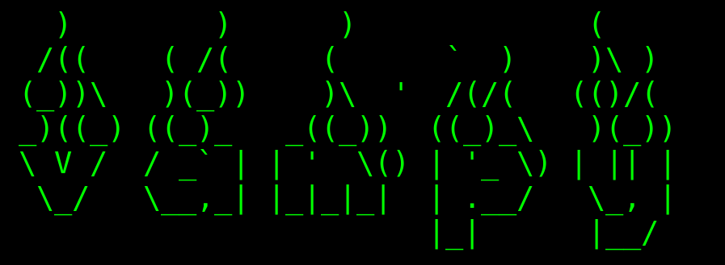

# vampy

VAMPY - Minimal tool for RAM dumping.



## Installation
```
git clone https://github.com/m4n3dw0lf/vampy
cd vampy
python vampy.py
```

## Basics
```
usage:
  -o, --output <DIRECTORY/PATH>		Output directory to store dump results
					(strings of all dumped data will be sa
					ved in the local directory)
					
  -u, --usb				Specify that the dump will be made on 
  					USB connected device.					

  -p, --process <NAME>			Name of application to dump

tips:
  Use frida-ps to get process names and PIDs

e.g:
  $python vampy.py -p firefox-esr
```
